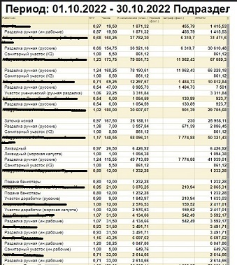
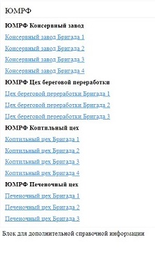
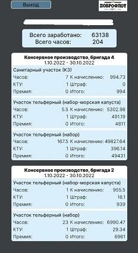
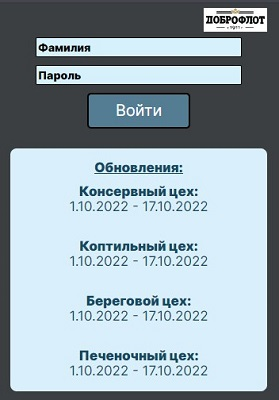

# Моя зарплата.
Мобильное веб-приложение, для мониторинга работником своей эффективности работы, оцененной в рублях.\
Верстка подразумевает использование только на мобильных устройствах.

Тренировочный проект. Учусь выстраивать инфраструктуру, работать с базами данных, закрепляю навыки полученные на курсе ЯПрактикума "Веб-разработчик".

------
На данный момент средство получения информации выглядит так:




## Недостатки:
- доступ только в пределах локальной сети предприятия.
- отдельная страница ```html``` для каждого подразделения, если дни работы выпадают на несколько подразделений искать себя приходится в cписках на нескольких страницах.
- мелкий шрифт;
- перечисляются все работники подразделения, - тяжело себя найти.
- информация по зарплате открыта для всех.

## Мое приложение
- работает в сети интернет;
- информация собирается со всех страниц подразделений и выдается в компактном и наглядном виде;
- доступ к профилю работника осуществляется после введения идентифицирующих данных логина-ФИО и пароля;
- имеет потенциал для расширения предоставляемой работнику информации.




Актуальность информации для подразделений отображается на начальной странице с формой.

Разработка велась в парадигме ООП, структура и наименование компонентов в стиле БЭМ.\
Для сборки проекта используется Webpack.

Webpack соберет оптимизированный проект в папку dist:

    npm run build

## Как работает
Базу данных наполняю информацией взятой из ```HTML``` файлов, скачанных со служебной сети компании. 
- файлы ```HTML``` скачиваю и отправляю на сервер для отбработки с помощью [приложения](https://github.com/CyrilLaz/file-archive-internet) запущенного на смартфоне в программе Termux.
- разработка приложения для работы с базой данных находится [тут](https://github.com/CyrilLaz/salary_dobroflotDB). В ветке ``develop``.

## Мое приложение не лишено недостатков, которые я планирую исправить:
- каждый раз входя на страницу надо вводить логин пароль - сделаю jwt аутентификацию;
- база данных предоставляет информацию снятую на текущий момент, не сохраняются предыдущие месяца - на этапе разработки;
- валидация полей - убирать пробелы в конце;
- исчезновение окна ошибки;
- поправить верстку для длинного текста консервного производства

## Доработки по отзывам коллег
- увеличить текст в карточках;
- вынести общую сумму штрафа.

## В планах
- по завершению разроботки серверной части переделать клиентскую на react;
- переключение месяцов планирую релизовать методом пагинации - прошлый-следующий месяц;
- реализовать возможность смены пароля для пользователя;
- реализовать отдельный клиент для администрирования учетных записей;
- страница в профиле для манипулирования годичной статистикой.

[ссылка](https://zarplata.klazar.ru/)
